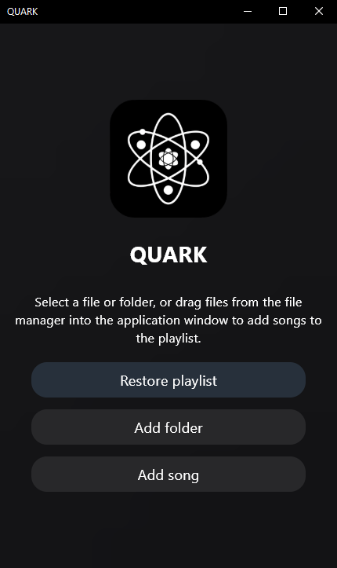
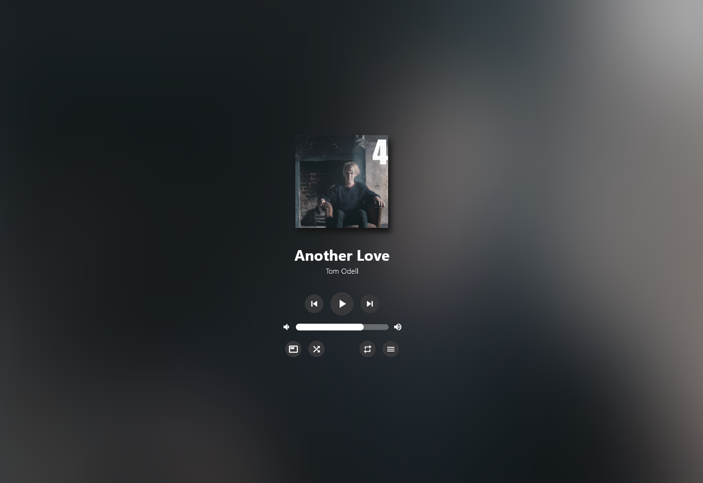

# Quark 

**🚨 WARNING:**  
**At the moment there are no ready-made window layouts for operating systems (folders windows, linux macos).**  

**Attention! This is a Pre-Alpha version of Quark for testing purposes**  
**It doesn't represent the final quality of the product. Thank you for your understanding and support.**  

**Quark is expected to be released with patch 0.78**

## 🚀 About  
**Quark is an open-source music player without the bloat.**
**It is a lightweight audio player inspired by the philosophy of **Amberol**. It still has no delusions of grandeur, if you just want to play music available on your local system, then this is your choice.**




---

**Tech Stack**:  
 Powered by **Flutter**  
 Cross-platform (at the moment only-desktop) (Windows/Linux/macOS)  

---

# QUARK Roadmap :

## Coming Soon:  
- Optimized database for playlists  
- Performance improvements  
- Drag-and-drop support  
- Multiple interface settings
- Adding a micro tour to the app on first launch.  
- Change of design concept?  
- Create a beautiful app installer with the ability to automatically update the app.  

## Future huge updates (Patch 1.1-1.9.9)
- Addition of QUARK TAG firmware for built-in and convenient customization of audio file metadata.  
- Possible implementation of automatic search for metadata for your song based on the title, duration and other metadata of the track, and a trained model, on the basis of which the search for metadata from open sources and datasets will be carried out.  
- Creating a beautiful website for downloading the application.  

## Dreams update:  
- Phone support
- Video playback support  
- FLAC downloads from open sources  
- Spotify/Deezer 


# Installation
```bash
1. Clone source repository
2. Create Flutter project
3. flutter pub get
4. flutter build {your_os}
5. flutter run
```
