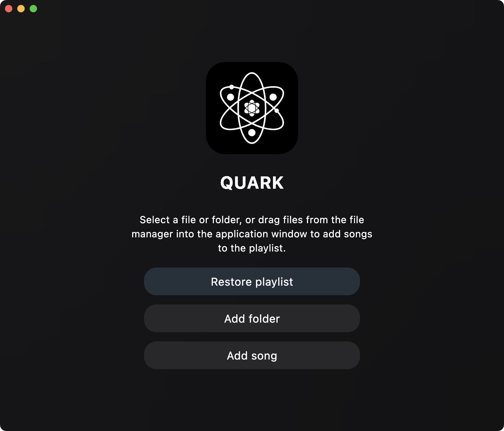
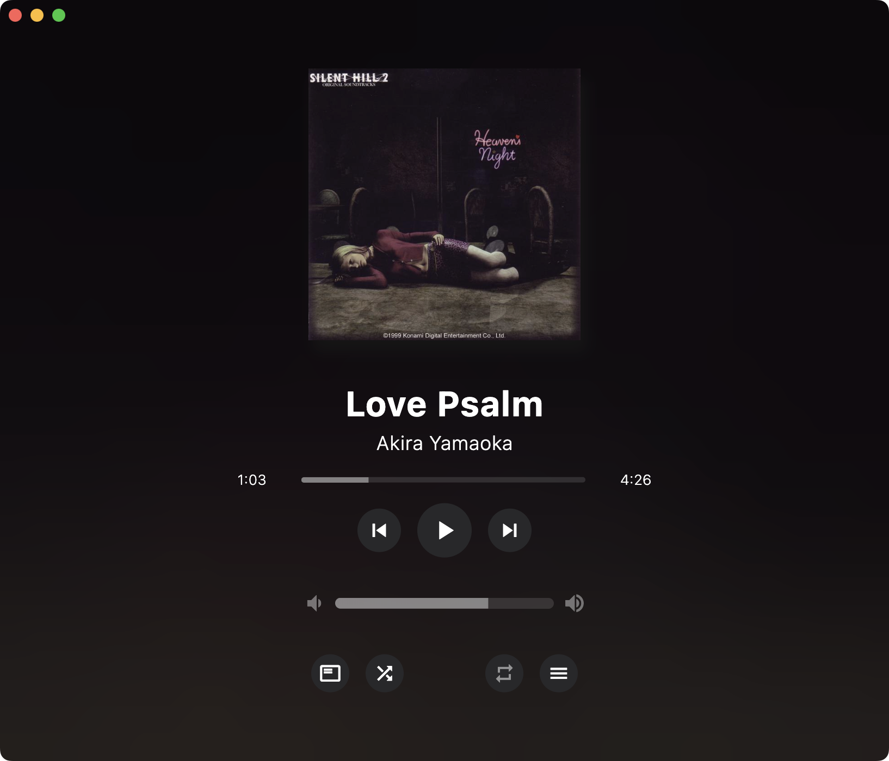

  
    

  

<h1 align="center" >  
  QUARK - lightweight, easy to use and beautiful? audio player for desktop platforms   
</h1>  

--- 

## Features:  
 + Support for all audio file formats (including FLAC recorded in mp3))
 + Full desktop support across multiple platforms
 + Some will be released tomorrow.

## Yandex music feature
 #### Features:
 + Ability to listen to and save your playlists from Yandex Music (immediately with track tags).  
 + Automatic login to your account and getting a token to work with Yandex Music  
 
 #### The following functionality will be added in the near future:  
 + changing user playlists  
 + searching for tracks across all Yandex Music  
 + mixing Yandex Music and local tracks.  
 + loading local tracks into Yandex Music  
 + ability to select track loading quality.  
 + display of short video clips just like in Yandex Music Mobile

 #### There are currently several limitations:  
 + 0. NO LINUX SUPPORT... I'M CRYING...  
 + 1. No online support for real-time work (work without saving local playlists). Playlists are completely cached on your device. If desired, they can be exported from the %temp%/quark folder.  
 + 2. Only listening to user playlists is available.  
 + 3. Works only with a Yandex Plus subscription  

## Coming Soon:  
 + release 1 
 + performance improvements  
 + OS native media control  
 + drag-and-drop support 
 + yandex music integration  
 + automatic loading of metadata for tracks 

---

## Installation
 > [!WARNING]
 > To use player on Windows you need to install [Microsoft Visual C++ Runtime](https://aka.ms/vs/17/release/vc_redist.x64.exe) (vcredist.exe).  
   
 + For full installation on Windows/Linux you can download quarkInstaller.exe (quarkInstaller.appImage).
 + For portable use download system-release.zip  
  
 + You can find all the necessary files on the [releases tab](https://github.com/z3nsh0w/QUARK/releases)  

 
 The solution for MacOS will be tomorrow  

---

## System requirements  
 + Windows 10 1809 or older, Macos 10.15 or older, Linux uncertainty
 + Visual C++ Runtime on Windows  
 + File Chooser Dialog dependency on Linux
 + Stable internet (for using Yandex.Music)

---

### Quark Installer
 > [!WARNING]  
 > If you have an operating system older than Windows 10 1809, you will need to install Webview2 Runtime.
 > 
 > On Linux systems, you need to have libwebkit2gtk or qtwebengine (usually they are pre-installed in popular distributions).  

  You can find the source code of the installer in the [nearby repository](https://github.com/z3nsh0w/quark-installer/)

  

---
