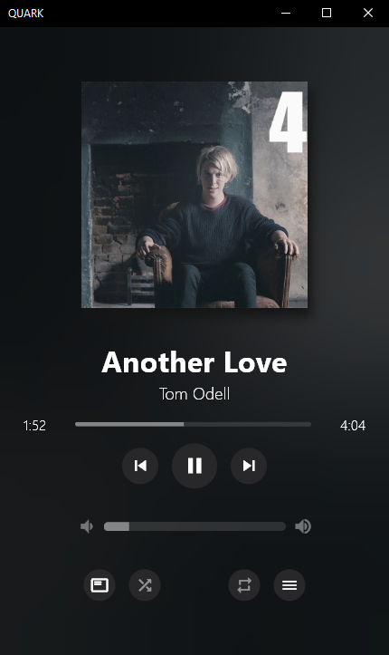

🚨 #WARNING: THIS REPO IS FOR SOURCE CODE ONLY
🚨 #If You want to download finished and compiled files you need to go to the releases tab

# Musician 

**An open-source music player without the bloat**  

## 🚀 About  
**Musician is an open-source music player without the bloat.**
**It is a lightweight audio player inspired by the philosophy of **Amberol**. It still has no delusions of grandeur, if you just want to play music available on your local system, then this is your choice.**

---

**Tech Stack**:  
 Powered by **Flutter**  
 Cross-platform (only-desktop) (Windows/Linux/macOS)  

---

## 🗺️ Roadmap :

### 🔥 Coming Soon:  
- 🗃️ Optimized database for playlists  
- ⚡ Performance improvements  
- ✨ Drag-and-drop support  

### 💡 Future Ideas (My dreams):  
- 📹 Video playback support  
- ⬇️ FLAC downloads from open sources  
- 🌐 Spotify/Deezer API integration (*years in the making…*)  

---

## 🛠 Installation :
**STEPS:**
 - Download source
 - Create flutter project
 - run `flutter build {your_operating_system}`
 - run `flutter pub get`
 - run `flutter run`
